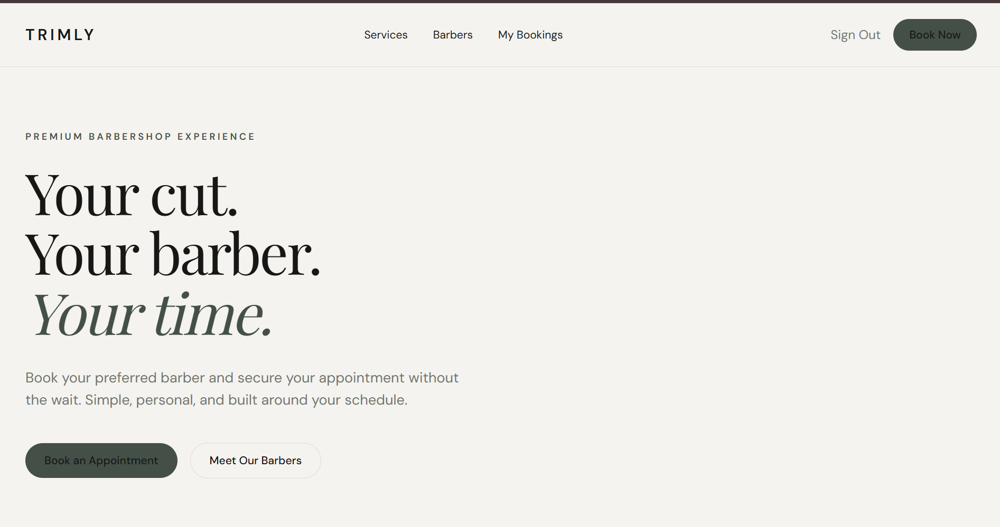
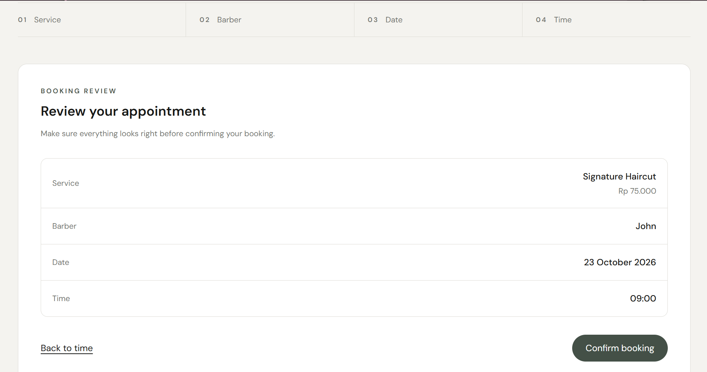
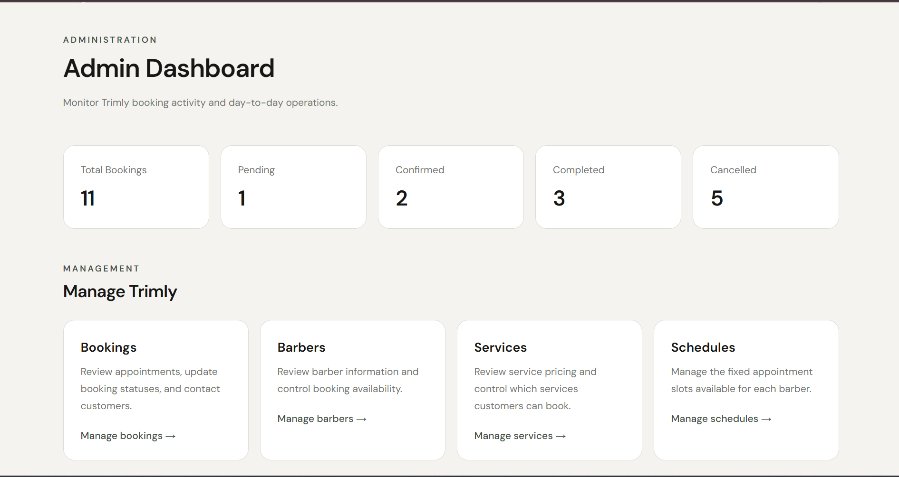

# Trimly

A full-stack barbershop appointment booking platform built to make scheduling simple for customers while giving barbershop administrators control over bookings, services, barbers, and availability.

🌐 **Live Demo:** https://trimly-bay.vercel.app



## Overview

Trimly is a portfolio full-stack web application designed around a real barbershop booking workflow.

Customers can browse services and barbers, choose an available appointment slot, manage their bookings, and leave a review or mock tip after a completed appointment.

Administrators can manage bookings, barbers, services, and barber schedules through a dedicated admin dashboard.

Unlike duration-based scheduling systems, Trimly uses predefined appointment slots. Availability is calculated from each barber's schedule and existing active bookings.

## Features

### Customer

- Register and sign in with email and password
- Browse active barbers and services
- View barber profiles, ratings, and completed booking counts
- Select a service, barber, date, and available appointment slot
- Review booking details before confirmation
- View personal booking history
- Cancel eligible upcoming bookings
- Submit one review after a completed appointment
- Leave one simulated tip after a completed appointment

### Admin

- View booking statistics and recent bookings
- View customer contact information
- Contact customers through WhatsApp
- Confirm, complete, or cancel bookings through controlled status transitions
- Activate or deactivate barbers
- Activate or deactivate services
- Manage individual barber schedule slots

## Booking Flow



Trimly follows a four-step booking process:

1. **Service** — choose an active grooming service
2. **Barber** — select an active barber
3. **Date** — choose an appointment date
4. **Time** — select one of the barber's available predefined slots

Before creating the booking, Trimly displays a final summary containing the selected service, barber, date, time, and price.

## Admin Dashboard



The admin dashboard provides operational control over the barbershop while keeping customer and administrative workflows separated.

## Tech Stack

- **Framework:** Next.js 16 (App Router)
- **Language:** TypeScript
- **Styling:** Tailwind CSS
- **Database:** PostgreSQL
- **ORM:** Prisma
- **Authentication:** Better Auth
- **Database Hosting:** Neon
- **Deployment:** Vercel

## Architecture

Trimly uses a single full-stack Next.js application.

The App Router handles both the user interface and server-side routes, while Prisma provides type-safe access to PostgreSQL.

The application is divided into several main areas:

- Public pages for services and barber discovery
- Customer authentication and booking management
- Server-side booking and availability logic
- Protected administrative pages and API routes
- PostgreSQL persistence through Prisma

This architecture keeps the project straightforward while still maintaining clear separation between UI, business logic, authentication, and persistence.

## Database Design

The main business entities are:

- `User`
- `Barber`
- `Service`
- `BarberSchedule`
- `Booking`
- `Review`
- `Tip`

A booking connects a customer, barber, and service with a specific date and predefined appointment slot.

The service price is copied into `priceAtBooking` when the booking is created so historical bookings retain the original price even if the service price changes later.

Reviews and tips are associated with bookings, allowing the application to verify ownership and booking status before accepting post-service actions.

## Availability & Double-Booking Protection

Availability is not determined only by the frontend.

For a selected barber and date, Trimly:

1. Reads the barber's configured schedule
2. Retrieves existing active bookings
3. Removes already-reserved slots
4. Rejects past dates and elapsed same-day slots
5. Returns only currently available appointment times

The database also enforces uniqueness for active `PENDING` and `CONFIRMED` reservations for the same barber, date, and appointment slot.

This provides a final database-level safeguard against race conditions where two customers attempt to reserve the same slot at nearly the same time.

## Booking Lifecycle

Bookings use four statuses:

```text
PENDING → CONFIRMED → COMPLETED
    │          │
    └──────────┴────→ CANCELLED
```

Status transitions are validated on the server rather than trusted from the client.

Examples:

- Customers cannot cancel completed or already-cancelled bookings
- Past appointments cannot be cancelled
- Admins cannot mark a future appointment as completed
- Reviews and tips are accepted only for completed bookings

The business timezone is explicitly handled as `Asia/Jakarta` (WIB) for appointment date and time validation.

## Authentication & Authorization

Trimly uses Better Auth with email and password authentication.

The application currently defines two user roles:

- `CUSTOMER`
- `ADMIN`

Administrative routes validate the authenticated user's role before allowing management actions.

Barbers are modeled as business entities rather than authenticated users in the current MVP.

## Reviews & Tips

After an appointment is marked `COMPLETED`, the customer can:

- Submit a rating from 1–5
- Add an optional written review
- Leave a simulated tip

Each booking can have at most one review and one tip.

Tips are intentionally simulated in this portfolio version. No real payment is processed.

## Running Locally

### 1. Clone the repository

```bash
git clone https://github.com/jamesmichl/Trimly.git
cd Trimly
```

### 2. Install dependencies

```bash
npm install
```

### 3. Configure environment variables

Create a `.env` file in the project root and configure the required environment variables:

```env
DATABASE_URL="your_postgresql_connection_string"
DIRECT_URL="your_direct_postgresql_connection_string"
BETTER_AUTH_SECRET="your_auth_secret"
BETTER_AUTH_URL="http://localhost:3000"
```

Do not commit the `.env` file.

### 4. Generate the Prisma Client

```bash
npx prisma generate
```

### 5. Apply database migrations

```bash
npx prisma migrate deploy
```


### 6. Start the development server

```bash
npm run dev
```

Open `http://localhost:3000` in your browser.

## Key Technical Decisions

### Predefined slots instead of service duration

Trimly intentionally does not calculate appointment length from individual services. Barbers expose predefined appointment slots, making availability predictable and keeping the scheduling model aligned with the project's requirements.

### Barber as a business entity

The MVP does not create a separate authenticated barber role. Barber profiles and schedules are managed by administrators, reducing unnecessary authentication complexity while preserving room for a dedicated barber dashboard in a future version.

### Database-level concurrency protection

Checking slot availability in the browser is not sufficient because two booking requests can arrive concurrently.

Trimly therefore combines application-level availability checks with a database constraint that prevents multiple active reservations from occupying the same barber/date/slot combination.

### Historical price snapshot

A booking stores `priceAtBooking` rather than depending on the service's current price. This prevents historical booking records from changing when an administrator updates service pricing.

## Project Status

Trimly currently includes the complete MVP workflow:

**Customer discovery → authentication → booking → booking management → admin operations → appointment completion → review & simulated tip**

The application is deployed and running in production on Vercel.

## Author

**James**

Computer Science student building full-stack and computer vision projects for practical software engineering experience.